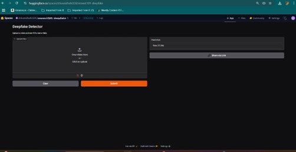
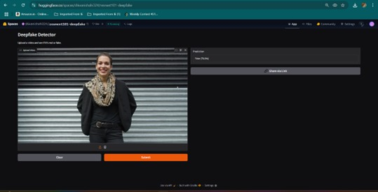
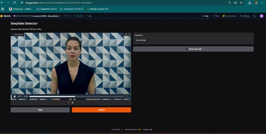

<<<<<<< HEAD
---
title: "ResNeXt101 Deepfake Detector"
colorFrom: indigo
colorTo: pink
sdk: gradio
sdk_version: 3.50.2
app_file: app.py
pinned: false
---

# Deepfake Detector using ResNeXt101 and Gradio

This application detects whether an uploaded video is real or deepfake using a ResNeXt101-based deep learning model, fine-tuned on facial video data.

## Functionality

Upon uploading a video (MP4 format), the system performs the following steps:

- Extracts faces from 10 sampled frames using Haar cascade-based face detection
- Applies preprocessing and normalization
- Feeds each extracted face into a ResNeXt101 classifier
- Aggregates predictions and returns either "Real" or "Fake" along with a confidence score

## Model Architecture

- Base model: ResNeXt101-32x8d
- Modified final layers for binary classification
- Trained on face crops from FaceForensics++ and similar datasets

## Face Detection

- OpenCV's Haar cascade used for detecting frontal faces
- Resized to 128x128 before feeding to the model

## Hosting

- Gradio interface used for user interaction
- Hosted on Hugging Face Spaces
- Model weights are downloaded from the Hugging Face Hub during runtime

## Requirements

See `requirements.txt` for all dependencies.

To run locally:
```bash
pip install -r requirements.txt
python app.py
```

## Deployment Link

Hosted on Hugging Face:  
https://huggingface.co/spaces/shivanishahi324/resnext101-deepfake


## Screenshots

### 1. Initial Interface


### 2. Prediction Output – Fake


### 3. Prediction Output – Real

=======
# DeepFake-Identification-on-Video
>>>>>>> 526903e28192cf227c45cfa78ffd811b1c32f726
